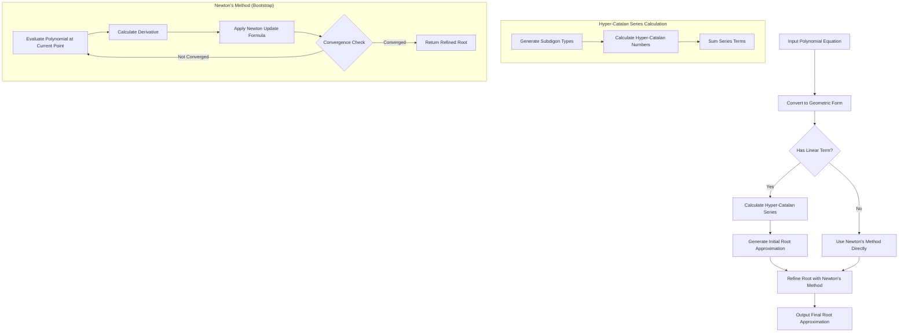

# Hyper-Catalan Polynomial Solver

A C++ implementation of the Hyper-Catalan series method for solving polynomial equations, based on the paper "A Hyper-Catalan Series Solution to Polynomial Equations, and the Geode" by N.J. Wildberger and K.W. Rubin.

## Overview

This project implements a novel approach to finding roots of polynomial equations using Hyper-Catalan numbers and series. The method is particularly interesting from a theoretical perspective, connecting algebraic solutions to combinatorial structures called subdigons.

## Features

- High-precision arithmetic using Boost's `cpp_dec_float_50` type
- Implementation of Hyper-Catalan number calculations
- Conversion between standard polynomial form and geometric form
- Series approximation of polynomial roots
- Newton's method for refining root approximations
- Comprehensive test suite

## Dependencies

- C++17 compiler
- [Boost](https://www.boost.org/) library
- [Eigen](http://eigen.tuxfamily.org/) library
- [Google Test](https://github.com/google/googletest) (for testing, automatically downloaded by CMake)

## Building

```bash
mkdir build
cd build
cmake ..
make
```

## Running

```bash
./hyper_catalan_solver
```

The program will prompt you to enter:
1. The degree of the polynomial
2. The coefficients (from constant term to highest degree)
3. Initial guess for bootstrap method (optional)
4. Number of iterations for bootstrap method

## Testing

```bash
cd build
./hyper_catalan_tests
```

## Mathematical Background

### Hyper-Catalan Numbers

Hyper-Catalan numbers are a generalization of Catalan numbers, defined for a tuple (m₂, m₃, m₄, ...) representing the number of faces with different polygon sizes. For a subdigon type m = (m₂, m₃, m₄, ...), the corresponding Hyper-Catalan number is:

```
C_m = (2m₂ + 3m₃ + 4m₄ + ...)! / ((1 + m₂ + 2m₃ + 3m₄ + ...)! · m₂! · m₃! · m₄! · ...)
```

### Polynomial Solving

The method works by transforming a polynomial equation into a geometric form:

```
1 - a + t₂a² + t₃a³ + ... = 0
```

Then, using the Hyper-Catalan series, we can find the root of this equation as:

```
a = ∑ C_m · t₂^m₂ · t₃^m₃ · t₄^m₄ · ...
```

The sum is over all possible subdigon types.

## Algorithm Flow

Below is a flowchart of the algorithm used for solving polynomial equations:



## Author

Eugen Soloviov
- Email: suenot@gmail.com
- Telegram: [@suenot](https://t.me/suenot)

## License

This project is licensed under the MIT License - see the LICENSE file for details.

## Citation

If you use this implementation in your research, please cite the original paper:

```
Wildberger, N.J., & Rubin, K.W. (2023). A Hyper-Catalan Series Solution to Polynomial Equations, and the Geode.
```

### BibTeX

```bibtex
@article{wildberger2025hypercatalan,
  title={A Hyper-Catalan Series Solution to Polynomial Equations, and the Geode},
  author={Wildberger, Norman J. and Rubine, Dean},
  year={2025},
  journal={American Mathematical Monthly},
  publisher={Taylor \& Francis},
  doi={10.1080/00029890.2025.2460966},
  url={https://www.tandfonline.com/doi/full/10.1080/00029890.2025.2460966},
}
```

You can also cite this C++ implementation:

```bibtex
@software{soloviov2023hypercatalancpp,
  author = {Soloviov, Eugen},
  title = {Hyper-Catalan Polynomial Solver (C++)},
  year = {2025},
  url = {https://github.com/suenot/hyper-catalan-cpp},
  version = {0.1.0},
  description = {A C++ implementation of the Hyper-Catalan series method for solving polynomial equations}
}
```

There is also a Rust implementation available:

```bibtex
@software{soloviov2023hypercatalanrs,
  author = {Soloviov, Eugen},
  title = {Hyper-Catalan Polynomial Solver (Rust)},
  year = {2025},
  url = {https://github.com/suenot/hyper-catalan-rs},
  version = {0.1.0},
  description = {A Rust implementation of the Hyper-Catalan series method for solving polynomial equations}
}
```